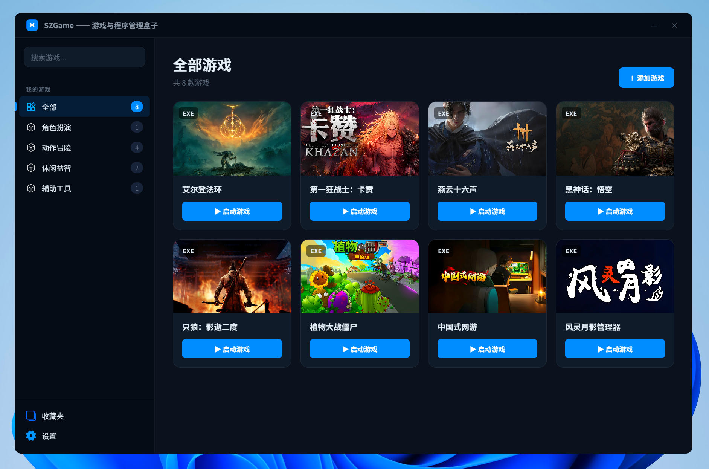
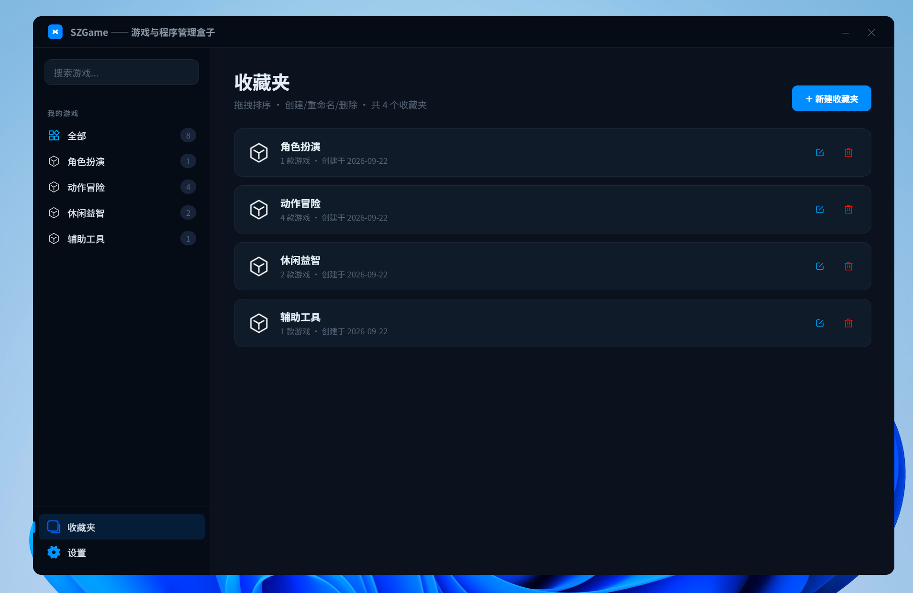
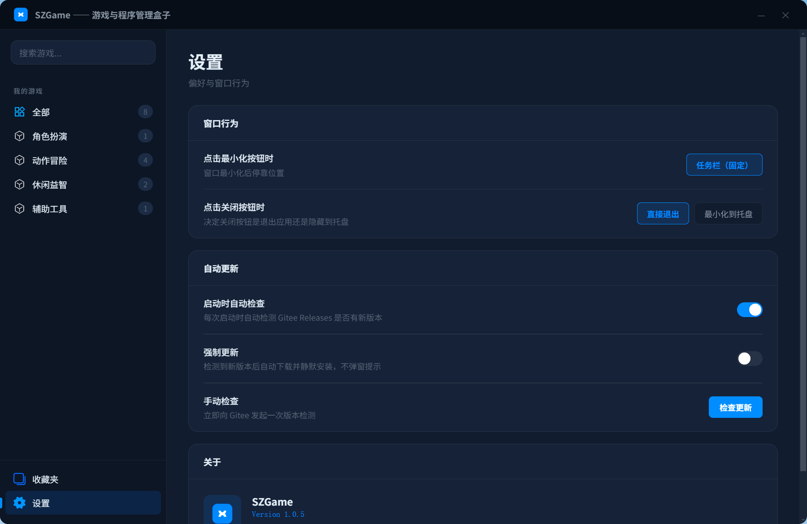

# SZGame —— 游戏与程序管理盒子

一款面向 Windows 的本地游戏与程序集中管理工具。将你散落在磁盘各处的 exe、bat、网址链接统一收纳到一个美观的卡片界面中，支持分组、搜索、封面管理、拖拽排序、提权启动和自动更新。

> 文档版本对应 v1.0.3

---

## ✨ 功能特性

| 功能 | 说明 |
|---|---|
| 🎮 游戏卡片网格 | 以封面卡片形式展示，支持 exe、bat、URL 三种启动类型 |
| 📦 分组管理 | 创建/重命名/删除分组，拖拽调整顺序，跨分组归类游戏 |
| 🔍 全局搜索 | 顶部搜索框，300ms 防抖模糊匹配，跨分组聚合展示 |
| 🖼️ 封面管理 | 本地上传图片或从 Steam 远程抓取封面，点击放大预览 |
| ⚡ 快速启动 | 一键启动，支持命令行参数和管理员权限（提权）启动 |
| 🔀 拖拽排序 | 卡片在分组内自由拖拽，排序自动持久化 |
| 🛠️ 系统托盘 | 最小化/关闭可选隐藏到托盘，托盘图标支持恢复窗口和退出 |
| 🔄 自动更新 | 从 Gitee Releases 检测新版本，支持手动确认或强制静默更新 |
| 💾 嵌入式数据库 | 使用 sql.js，无需额外安装数据库，单文件便携 |

---

## 🖥️ 界面预览

### 首页 — 全部游戏

主界面以卡片网格展示当前分组下的所有游戏，可切换分组、搜索、添加新游戏。



### 详情抽屉

点击卡片（启动按钮除外）打开右侧抽屉，查看封面大图、启动路径、启动类型、提权运行状态，可直接启动、编辑或删除。


### 收藏夹（分组管理）

在收藏夹页面管理所有分组——新建、重命名、删除、拖拽排序。删除含游戏的分组时会有二次确认。



### 设置

配置窗口最小化/关闭行为、自动更新策略，手动检查更新，查看当前版本号。



---

## 🚀 快速开始

### 环境要求

- Node.js ≥ 18
- Windows 操作系统（目标平台）

### 安装依赖

```bash
npm install
```

### 开发模式运行

```bash
npm run dev
```

Vite 会启动开发服务器并热渲染。Electron 主进程通过 vite-plugin-electron 同步运行。

---

## 📦 构建发布

```bash
npm run build
```

该命令依次执行 `tsc`（TypeScript 编译）→ `vite build`（渲染进程打包）→ `electron-builder`（生成 NSIS 安装包）。

构建产物输出到 `release/` 目录：

```
release/
├── SZGame Setup 1.0.3.exe   # NSIS 安装包
└── win-unpacked/             # 解压后的可执行目录
```

安装包特性：
- 可自定义安装目录
- 自动创建桌面快捷方式和开始菜单快捷方式
- 卸载时保留用户数据目录

---

## 🛠️ 技术栈

| 类别 | 技术 |
|---|---|
| 桌面框架 | Electron 32 |
| UI 框架 | React 18 + TypeScript |
| 构建工具 | Vite 5 + vite-plugin-electron |
| 数据库 | sql.js（SQLite，嵌入式） |
| 拖拽 | @dnd-kit |
| 打包 | electron-builder → NSIS |
| 自动更新 | Node.js https + Gitee Releases API |

---

## 📜 License

[MIT License](LICENSE) © 2026 博学浮生
